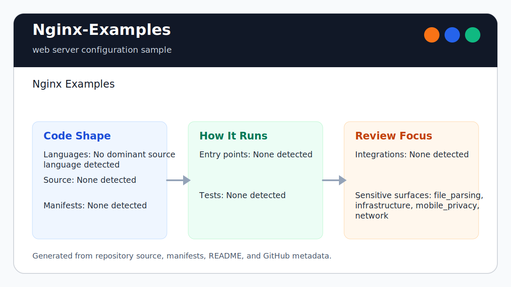

# Nginx-Examples

<!-- README-OVERVIEW-IMAGE -->


## Overview

`garethpaul/Nginx-Examples` is a small set of sample Nginx configurations for
PHP-style site includes and Tornado upstream proxying.

This README is based on the checked-in source, manifests, scripts, and repository metadata on the `master` branch. The project language mix found during review was: no dominant source language detected.

## Repository Contents

- `.gitignore` - local environment/log/test-output ignores
- `CHANGES.md` - baseline change log
- `Makefile` - host-portable static verification entry point
- `README` - compatibility pointer to this README
- `SECURITY.md` - security reporting and disclosure guidance
- `VISION.md` - project direction and maintenance guardrails
- `sample_php_nginx.conf` - full Nginx config skeleton with PHP/site include hooks
- `sample_tornado_nginx.conf` - reverse proxy example for local Tornado workers
- `scripts/check-nginx-examples.py` - static baseline checks used by `make check`

Additional scan context:

- Source directories: no top-level source directories detected
- Dependency and build manifests: none detected
- Entry points or build surfaces: `sample_php_nginx.conf`, `sample_tornado_nginx.conf`
- Test-looking files: `scripts/check-nginx-examples.py`

## Getting Started

### Prerequisites

- Git
- Python 3 for `make check`
- Nginx for real syntax checks with `nginx -t`

### Setup

```bash
git clone https://github.com/garethpaul/Nginx-Examples.git
cd Nginx-Examples
make lint
make test
make build
make check
```

The setup commands above are derived from repository files. Legacy mobile, Python, or JavaScript samples may require older SDKs or package versions than a modern workstation uses by default.

## Running or Using the Project

Treat both configs as sample-only starting points, not production-ready
drop-ins. The checked-in values demonstrate configuration structure and basic
safeguards; they are not a production capacity, routing, or security policy.

### `sample_php_nginx.conf`

This file is a full `nginx.conf`-style skeleton for a host that loads separate
site configuration files. Before using it, review and adapt:

- the `user`, worker count, pid path, and log paths for the host's service
  account and process manager
- the relative `mime.types` path and the absolute
  `/usr/local/nginx/sites-enabled/*.conf` include path
- `worker_connections`, keepalive, gzip, and `client_max_body_size 1m` for the
  deployment's traffic and upload policy
- the included site files, including their domains, roots, FastCGI upstreams,
  TLS listeners, and certificate placeholders

The `sites-enabled/*.conf` glob intentionally excludes unrelated backup files,
but operators still need to review every matching file and its permissions.

### `sample_tornado_nginx.conf`

This file is a reverse proxy example for four loopback Tornado workers. It sets
`Host`, `X-Real-IP`, `X-Forwarded-Host`, `X-Forwarded-For`,
`X-Forwarded-Proto`, and `X-Forwarded-Port`, and hides upstream `Server` headers with
`proxy_hide_header Server`. Proxy request header suppression also removes the
inbound `Proxy` field before forwarding. The Forwarded-For trust boundary
overwrites untrusted client chains with the direct peer address. The Forwarded
Host trust boundary pins upstream host identity to the configured server name
instead of client-selected host metadata. The WebSocket maps forward only a
case-insensitive `websocket` upgrade token; other client-selected protocols are
removed. Before using it, review and adapt:

- the loopback ports and process ownership for the actual Tornado workers
- `example.local` and `/srv/example-app` for the deployment domain and static
  root
- the five-second connect timeout and 30-second upstream I/O timeouts for the
  workload's latency and failure policy
- WebSocket upgrade proxying, including whether the 30-second read timeout is
  paired with application pings or increased for long-lived idle connections
- response and request buffering for streaming handlers; Nginx buffering stays
  enabled by default for ordinary HTTP traffic
- keepalive, gzip, `client_max_body_size 1m`, log paths, and TLS termination
- `use epoll;`, which is Linux-specific and must be removed or changed on
  unsupported platforms

The static location keeps `try_files $uri =404;` so missing assets fail closed
instead of falling through to another handler.
The `proxy_pass http://frontends;` directive intentionally has no URI suffix,
so Nginx preserves the incoming request path and query string.

This is a direct-edge example. `$remote_addr`, `$scheme`, and `$server_port`
are authoritative only when clients connect directly to this Nginx listener.
When deploying behind a load balancer or another proxy, configure the real-IP
module with exact trusted proxy CIDRs and derive scheme/port only from metadata
that trusted hop overwrites. Do not append client-supplied forwarding chains.

## Production Adaptation Checklist

For either sample, review domains, filesystem paths, service users, file
permissions, upstream endpoints, request-body limits, timeouts, logging and
retention, forwarded-header trust, listener exposure, and TLS before
installation. Preserve or deliberately replace the checked-in safeguards:

- `server_tokens off`
- `X-Content-Type-Options: nosniff`
- `X-Frame-Options: SAMEORIGIN`
- `Referrer-Policy: strict-origin-when-cross-origin`

Run deployment-host `nginx -t` against the fully adapted configuration before
installation or reload. A syntax check can still fail until referenced files,
modules, users, and permissions match that host.
The examples contain no TLS listener. Add HSTS only to an HTTPS virtual host
after the domain and its subdomains are fully ready for HTTPS; never emit HSTS
from the checked-in HTTP-only listener.

## Testing and Verification

- `make lint`
- `make test`
- `make build`
- `make check`
- The Make gates are location-independent. From another directory, pass the
  checkout's Makefile by absolute path, such as
  `make -f /path/to/Nginx-Examples/Makefile check`.
- `ROOT` overrides are ignored. Attempts to replace GNU Make's automatic
  `MAKEFILE_LIST` metadata fail before checker or live proxy recipes run.
- Pinned `ubuntu-24.04` GitHub Actions installs Ubuntu Nginx and runs the static,
  hostile-mutation, syntax, and live reverse-proxy boundary tests on Python
  3.12. Deployment-host `nginx -t` remains required after
  adapting local paths and modules. Checkout credentials are not persisted
  after source retrieval.
- `nginx -t -c /absolute/path/to/adjusted/nginx.conf` on the deployment host

The checked-in configs use host-specific paths such as `mime.types`, log files,
static roots, and include directories. Adjust those paths before running
`nginx -t` or installing the examples.
Do not install the checked-in configs directly. Copy them to a host-specific
test path, replace placeholder paths and names, run `nginx -t`, then install the
adapted copy.
The PHP sample keeps `sites-enabled/*.conf` so backup files or stray files are
not included as config by default.
Both samples include `client_max_body_size` so copied examples do not silently
inherit an overly broad upload/request-body policy.
The Tornado upstream group is loopback-only. `http://frontends` names that local
group; it is not guidance to proxy unverified public HTTP services.

When the required SDK or runtime is unavailable, use static checks and source review first, then verify on a machine that has the matching platform toolchain.

## Configuration and Secrets

- No required secret or credential file was identified in the repository scan.
- Keep real domains, private upstreams, certificate paths, environment files, generated logs, and pid files out of git.

## Security and Privacy Notes

- Both examples disable `server_tokens` with `server_tokens off`.
- The Tornado proxy example also hides upstream `Server` response headers with `proxy_hide_header Server`.
- Preserve the upstream connect timeout or document a deployment-specific replacement.
- Preserve explicit upstream I/O timeouts or document deployment-specific read
  and send values.
- The Tornado static location should keep `try_files $uri =404;` before use in
  live deployments.
- Both examples cap request bodies with `client_max_body_size` as a sample
  default.
- Both examples send `X-Content-Type-Options: nosniff` as a sample browser
  hardening header.
- Both examples send `X-Frame-Options: SAMEORIGIN` as a sample clickjacking
  guard.
- Both examples send `Referrer-Policy: strict-origin-when-cross-origin` as a
  sample referrer-leakage guard.
- Review changes touching network requests, sockets, proxy headers, upstreams, or service endpoints; examples from the scan include sample_tornado_nginx.conf.
- Review changes touching file, media, JSON, XML, CSV, OCR, or data parsing; examples from the scan include sample_php_nginx.conf, sample_tornado_nginx.conf.
- Review changes touching infrastructure, proxy, cloud, or deployment configuration; examples from the scan include sample_php_nginx.conf, sample_tornado_nginx.conf.
- Keep forwarded-header handling explicit; `X-Forwarded-Host`,
  `X-Forwarded-For`, `X-Forwarded-Proto`, and `X-Forwarded-Port` are part of the Tornado proxy
  example.
- Keep the Forwarded Host trust boundary sourced from `$server_name`, not
  client-selected `$host` or `$http_host`; adapt aliases or canonical hosts
  deliberately for the deployment.
- Keep the Forwarded-For trust boundary sourced from `$remote_addr` unless a
  deployment explicitly configures a trusted real-IP proxy chain.
- Keep Forwarded header suppression before `proxy_pass` so client-selected
  standardized forwarding metadata cannot bypass the explicit direct-edge
  `X-Forwarded-*` policy.
- Keep Proxy request header suppression before `proxy_pass`.
- Keep WebSocket upgrade proxying on HTTP/1.1 with the mapped `Connection`
  value so ordinary HTTP and non-WebSocket upgrade requests are not forced into
  upgrade mode.

## Maintenance Notes

- Run `make lint`, `make test`, `make build`, and `make check` before changing
  sample configs.
- Use an absolute Makefile path when running those static gates outside the
  checkout.
- Run `nginx -t` on a host with Nginx installed after adapting local paths.
- See `docs/plans/2026-06-09-make-gate-aliases.md` for the local verification
  gate aliases.
- See `docs/plans/2026-06-10-forwarded-host-header.md` for the forwarded host
  header guardrail.
- See `docs/plans/2026-06-10-setup-and-loopback-boundary.md` for setup and
  loopback-only upstream placeholders.
- See `SECURITY.md` for vulnerability reporting and safe research guidance.
- See `VISION.md` for project direction and contribution guardrails.

## Contributing

Keep changes small and tied to the project that is already present in this repository. For code changes, document the toolchain used, avoid committing generated dependency directories or local configuration, and update this README when setup or verification steps change.
